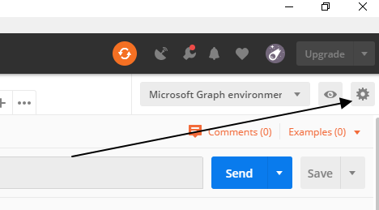
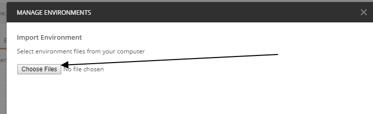

## 使用Postman调用Graph操作OneDrive

## 准备条件
* 安装 [Postman](https://www.getpostman.com/)

## 步骤

- 下载 [MicrosoftGraphPostman_collection.json](MicrosoftGraphPostman_collection.json)

- 按如下步骤导入第一步下载的MicrosoftGraphPostman_collection.json
  
  
  

- 导入后，先获取token，再调用其他API

  

注：
由于collection中有用到Postman的environment设置请求的变量，所以大家要新建一个environment[命名随意，只要有个环境并选择到这个环境就好]。

如果不知道如何创建，请直接下载[MicrosoftGraphEnvironment.postman_environment](MicrosoftGraphEnvironment.postman_environment.json)，并按照如下步骤导入即可(导入后选择此环境)  

