

# Developing and debugging a Task Module locally

## Prerequisites

The following tools should be installed.

1. [visual studio](https://visualstudio.microsoft.com/downloads)
2. [teams client](https://products.office.com/en-US/microsoft-teams/group-chat-software) or use [teams on web](https://teams.microsoft.com/)
3. [ngrok](https://ngrok.com/)

## Steps

- Make sure that the all required tools are installed.
- Use visual studio to open solution `Microsoft.Teams.Samples.TaskModule.sln` and run it(default with port 3333).
- Open ngrok terminal and run `ngrok.exe http 3333 -host-header="localhost:3333"`, copy https host
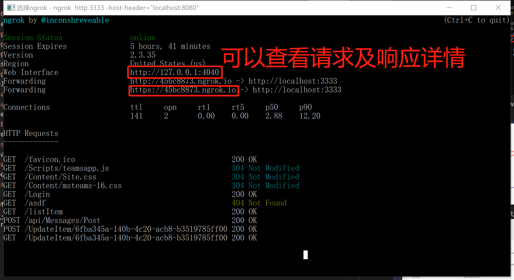
- Update web.config file accordingly
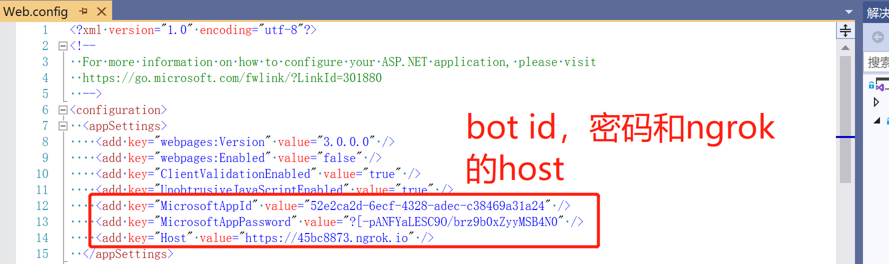
- Use App Studio to configure tab, bot, message extension.
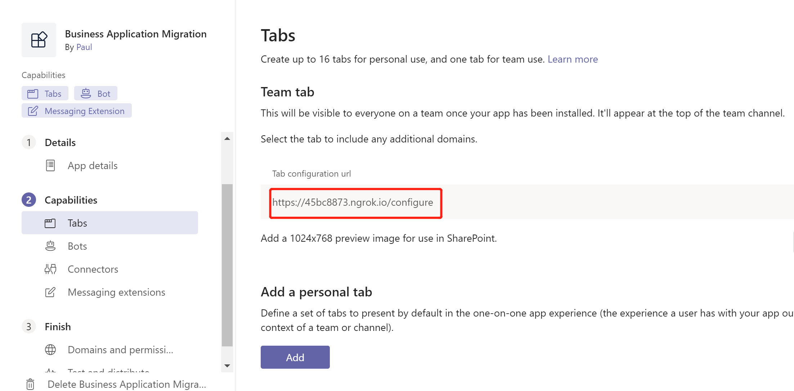
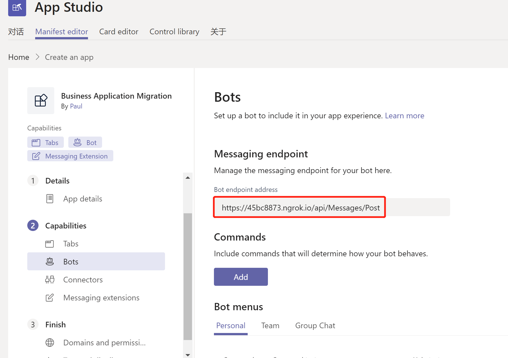
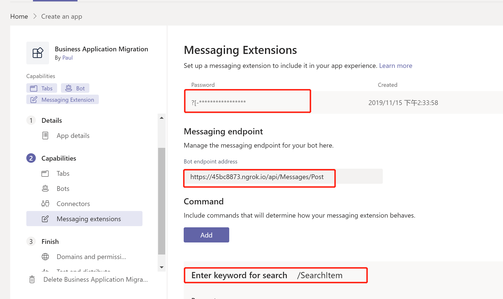
- Install application in App Studio
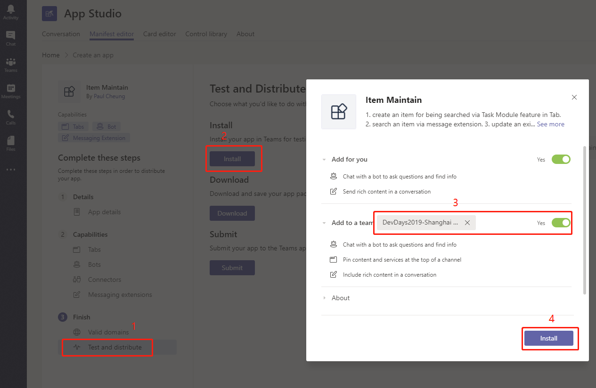
- Select feature to install(eg. Tab) and configure
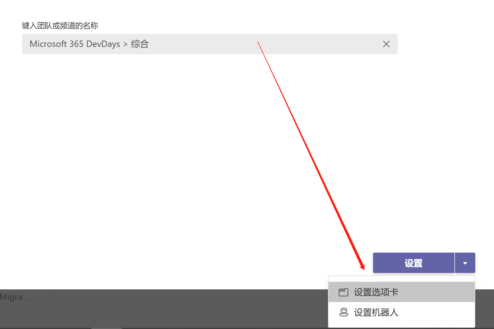
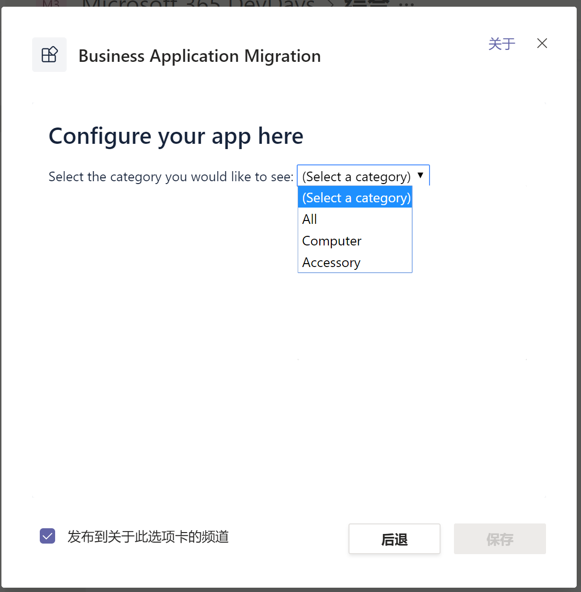
- Check installed tab
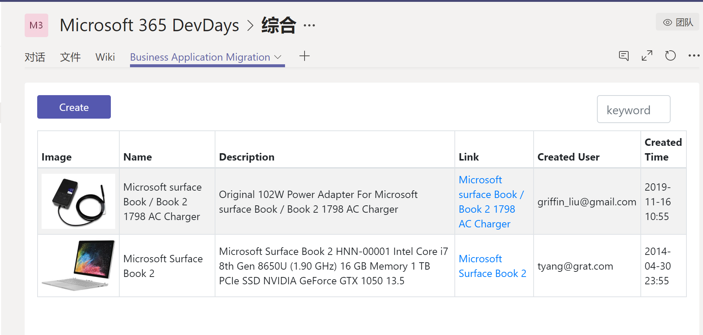
- Create Item(open task module in tab)
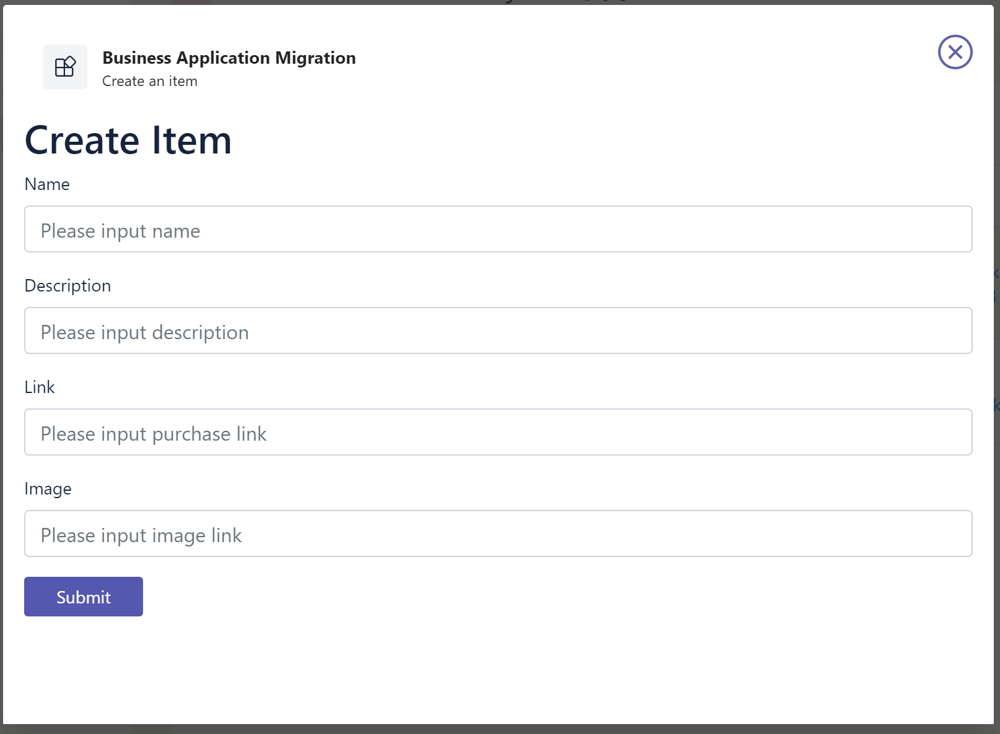
- Search items in message extension and send it to team members
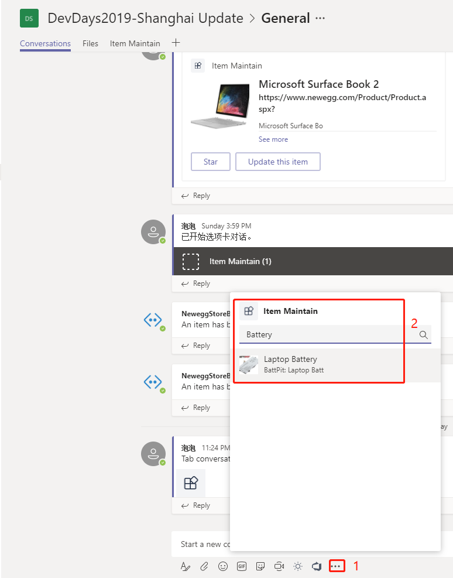
- Update item(click button "Update this item" to open update modal)
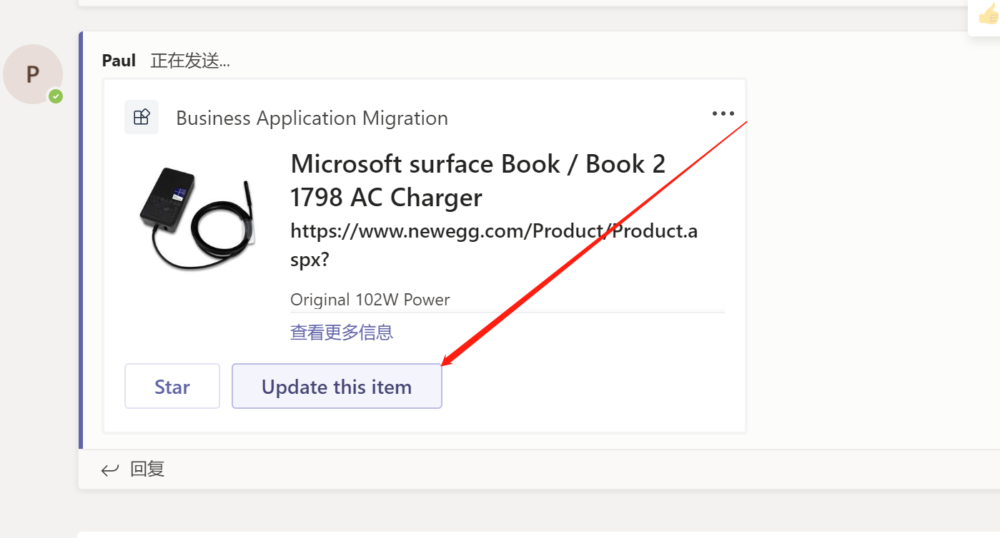

> Note: you can create a bot by following this [link](https://docs.microsoft.com/en-us/microsoftteams/platform/concepts/bots/bots-create), or in App Studio.
