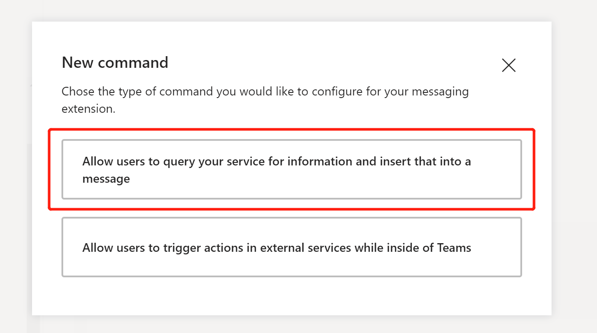

# 本地开发和调试Business.Application.Migration项目

## 准备条件

### 安装以下软件

1. [visual studio](https://visualstudio.microsoft.com/downloads)
2. [teams客户端](https://products.office.com/en-US/microsoft-teams/group-chat-software)或者使用[web版本](https://teams.microsoft.com/)
3. [ngrok反向代理工具](https://ngrok.com/)

### 下载代码

#### 方法1

### 方法2  

1. 需要安装git  
2. 复制代码仓库地址

3. 选择自己的文件夹(我这里的文件夹名称为github)，输入以下命令，回车，进行克隆

### 如何切换before和after分支

打开命令行，首先进入clone下来项目的目录，如下

1. 切换到before分支  
`> git checkout before`
2. 切换到after分支  
`> git checkout after`

## 步骤

- 使用visual studio打开解决方案 `Business.Application.Migration.sln`，运行起来(默认端口3333).
- 打开终端，运行ngrok，输入命令： `ngrok.exe http 3333 -host-header="localhost:3333"`, 记住这里的https的地址，一会儿会用。

- 相应更新web.config(如果我们已经在teams中国社区里了，可以使用已有代码中的bot，它是社区tenant下的一个bot)

- 使用App Studio配置tab, bot和message extension.

- Message Extension中的command定义（机器人的命令）

- 通过App Studio安装Business Application Migration应用，选择安装的功能（可以单独安装Tab, Bot，或者一起装，在“设置”按钮的下来框里选择）

- 配置Tab页面

- 打开添加的Tab页面

- 创建商品（点击Create按钮）

- 搜索商品发送到聊天里

- 更新商品

> 注: 如果自己想注册Bot，请点击[这里](https://docs.microsoft.com/en-us/microsoftteams/platform/concepts/bots/bots-create)，或者直接在App Studio里的Bot功能模块创建。

注：如果想查看Graph调用的文档，请切换到before分支进行查看。